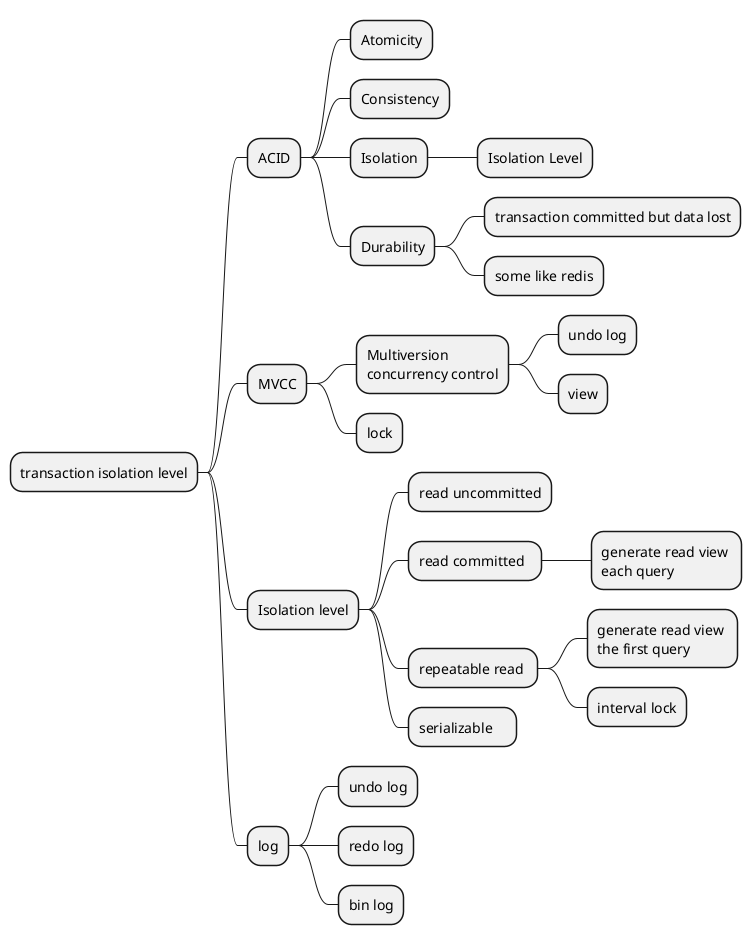

# mysql
[mysql](https://xuqilong.top/foundation/mysql/) 
## transaction isolation level



| isolation level  | dirty read | Non-repeatable Read | phantom read |
| ---              | ---        | ---                 | ---          |
| read uncommitted | possible   | possible            | possible     |
| read committed   | impossible | possible            | possible     |
| repeatable read  | impossible | impossible          | possible     |
| serializable     | impossible | impossible          | impossible   |

```sql
SHOW VARIABLES LIKE 'transaction_isolation';
# 设置为“读未提交”
SET SESSION TRANSACTION ISOLATION LEVEL READ UNCOMMITTED;
# 设置为“读已提交”
SET SESSION TRANSACTION ISOLATION LEVEL READ COMMITTED;
# 设置为“可重复读”
SET SESSION TRANSACTION ISOLATION LEVEL REPEATABLE READ;
# 设置为“序列化”
SET SESSION TRANSACTION ISOLATION LEVEL SERIALIZABLE;
```


### enviroment
```sql
mysql> SELECT VERSION();
+-----------+
| VERSION() |
+-----------+
| 5.6.51    |
+-----------+
```
### table and data prepare
```sql
mysql> DROP TABLE IF EXISTS `demo_user`;
mysql> CREATE TABLE `demo_user` (
  `id` varchar(32) NOT NULL COMMENT '用户id',
  `name` varchar(16) NOT NULL COMMENT '用户名',
  `gender` tinyint(1) DEFAULT '0' COMMENT '性别',
  `age` int(3) unsigned DEFAULT NULL COMMENT '用户年龄',
  `gmt_create` datetime DEFAULT CURRENT_TIMESTAMP ON UPDATE CURRENT_TIMESTAMP COMMENT '记录创建时间',
  `gmt_modified` timestamp NULL DEFAULT NULL COMMENT '记录最近修改时间',
  `deleted` tinyint(1) DEFAULT '0' COMMENT '是否删除',
  `phone` varchar(11) NOT NULL COMMENT '电话号码',
  PRIMARY KEY (`id`),
  KEY `idx_phone` (`phone`),
  KEY `idx_name` (`name`)
) ENGINE=InnoDB DEFAULT CHARSET=utf8mb4 COMMENT='用户表';

insert  into `demo_user`(`id`,`name`,`gender`,`age`,`gmt_create`,`gmt_modified`,`deleted`,`phone`) values ('222','zzs001',0,18,'2021-12-13 15:11:03','2021-12-13 09:59:12',0,'188******26');
insert  into `demo_user`(`id`,`name`,`gender`,`age`,`gmt_create`,`gmt_modified`,`deleted`,`phone`) values ('111','zzf001',0,18,'2001-08-27 11:00:11','2001-08-27 11:00:13',0,'188******22');
```


### Dirty Read
| session 1                                                 | session 2                                                 |
| ---                                                       | ---                                                       |
| set session transaction isolation level read uncommitted; | set session transaction isolation level read uncommitted; |
| select @@session.tx_isolation;                            | select @@session.tx_isolation;                            |
| set autocommit = 0 ;                                      | set autocommit = 0 ;                                      |
|                                                           | update demo_user set age=19 where id='222';                |
| select age from demo_user where id = '222';               |                                                           |
|                                                           | rollback ;                                                |
| commit;                                                   |                                                           |

- solution 1  
| session 1                                                      | session 2                                                 |
| ---                                                            | ---                                                       |
| set session transaction isolation level read uncommitted;      | set session transaction isolation level read uncommitted; |
| select @@session.tx_isolation;                                 | select @@session.tx_isolation;                            |
| set autocommit = 0 ;                                           | set autocommit = 0 ;                                      |
|                                                                | update demo_user set age=19 where id='222'                |
| select age from demo_user where id = '222' lock in share mode; |                                                           |
|                                                                | rollback ;                                                |
| commit;                                                        |                                                           |

- solution 2
| session 1                                               | session 2                                               |
| ---                                                     | ---                                                     |
| set session transaction isolation level read committed; | set session transaction isolation level read committed; |
| select @@session.tx_isolation;                          | select @@session.tx_isolation;                          |
| set autocommit = 0 ;                                    | set autocommit = 0 ;                                    |
|                                                         | update demo_user set age=19 where id='222';             |
| select age from demo_user where id = '222';             |                                                         |
|                                                         | rollback ;                                              |
| commit;                                                 |                                                         |


### Non-repeatable Read
| session 1                                               | session 2                                               |
| ---                                                     | ---                                                     |
| set session transaction isolation level read committed; | set session transaction isolation level read committed; |
| select @@session.tx_isolation;                          | select @@session.tx_isolation;                          |
| set autocommit = 0 ;                                    | set autocommit = 0 ;                                    |
| select age from demo_user where id = '222';             |                                                         |
|                                                         | update demo_user set age=19 where id='222';             |
|                                                         | commit ;                                                |
| select age from demo_user where id = '222';             |                                                         |
| commit;                                                 |                                                         |


- solution 1  add lock
| session 1                                                      | session 2                                               |
| ---                                                            | ---                                                     |
| set session transaction isolation level read committed;        | set session transaction isolation level read committed; |
| select @@session.tx_isolation;                                 | select @@session.tx_isolation;                          |
| set autocommit = 0 ;                                           | set autocommit = 0 ;                                    |
| select age from demo_user where id = '222' lock in share mode; |                                                         |
|                                                                | update demo_user set age=19 where id='222';             |
| select age from demo_user where id = '222' ;                   |                                                         |
| commit;                                                        |                                                         |
|                                                                | update demo_user set age=19 where id='222';             |
|                                                                | rollback ;                                              |

- solution 2  add lock
| session 1                                                | session 2                                                |
| ---                                                      | ---                                                      |
| set session transaction isolation level repeatable read; | set session transaction isolation level repeatable read; |
| select @@session.tx_isolation;                           | select @@session.tx_isolation;                           |
| set autocommit = 0 ;                                     | set autocommit = 0 ;                                     |
| select age from demo_user where id = '222' ;             |                                                          |
|                                                          | update demo_user set age=19 where id='222';              |
|                                                          | commit ;                                                 |
| select age from demo_user where id = '222' ;             |                                                          |
| commit;                                                  |                                                          |

### Phantom Read
| session 1                                                | session 2                                                                                                                                                                                    |
| ---                                                      | ---                                                                                                                                                                                          |
| set session transaction isolation level repeatable read; | set session transaction isolation level repeatable read;                                                                                                                                     |
| select @@session.tx_isolation;                           | select @@session.tx_isolation;                                                                                                                                                               |
| set autocommit = 0 ; start transaction;                  | set autocommit = 0 ; start transaction;                                                                                                                                                      |
| select * from demo_user;                                 |                                                                                                                                                                                              |
|                                                          | insert  into `demo_user`(`id`,`name`,`gender`,`age`,`gmt_create`,`gmt_modified`,`deleted`,`phone`) values ('444','zzf001',0,18,'2001-08-27 11:00:11','2001-08-27 11:00:13',0,'188******22'); |
|                                                          | commit ;                                                                                                                                                                                     |
| select * from demo_user;                                 |                                                                                                                                                                                              |
| commit;                                                  |                                                                                                                                                                                              |


## MySQL MVCC

## log
```sql
mysql> show variables like 'slow_query%';
mysql> set global slow_query_log = on;
mysql> show variables like 'long_query_time';
mysql> set global long_query_time = 1;
mysql> select sleep(2);

```
## sql optimization

### Download test database
```sh
gh repo clone datacharmer/test_db
wget https://downloads.mysql.com/docs/world-db.zip                       
wget https://downloads.mysql.com/docs/sakila-db.zip                      
wget https://downloads.mysql.com/docs/airport-db.zip                     
wget https://downloads.mysql.com/docs/menagerie-db.zip                   
wget https://github.com/datacharmer/test_db/archive/refs/tags/v1.0.7.zip 
```
```sql
mysql> SHOW ENGINES;
mysql> SHOW VARIABLES  LIKE '%storage_engine%';
mysql> SHOW VARIABLES  LIKE '%query_cache%';
mysql> use sakila;
mysql> show databases;
mysql> show tables;
mysql> \? show status
mysql> show status like 'Com_%';
mysql> show status like 'Innodb_%';
mysql> show status like 'Connections%';
mysql> show status like 'Uptime%';
mysql> show status like 'Slow_queries%';
mysql> show processlist;
mysql> explain select count(*) from actor t1, film_actor t2 where t1.actor_id=t2.actor_id;
mysql> explain select 1 from dual where 1;
```
### type
```sql
mysql> show create table actor;
mysql> select * from actor limit 10;

-- null: not use table
mysql> explain select 1 from dual where 1;
-- system: system table, only one line. special case of const
-- const
mysql> explain select * from actor where actor_id=1;
-- eq_ref: like ref, multitable join use primary key and unique index
mysql> explain select * from film a, film_text b where a.film_id=b.film_id;
-- ref
mysql> explain select b.*,a.* from payment a, customer b where a.customer_id=b.customer_id;
-- range
mysql> explain select * from actor where actor_id between 1 and 10;
-- All
mysql> explain select * from actor where first_name='JULIA';
mysql> explain select * from actor where first_name like 'J%';

mysql> show table status like 'payment'\G

mysql> explain format=json select * from payment where customer_id = 203 or amount = 3.96\G
mysql> select * from payment where customer_id = 203 or amount = 3.96;
mysql> show status like 'last_query_cost';
```
### Analyze SQL through performance_schema

```sql
mysql> SET OPTIMIZER_TRACE="enabled=on",END_MARKERS_IN_JSON=on;
mysql> SET OPTIMIZER_TRACE_MAX_MEM_SIZE=1000000;
mysql> select rental_id from rental where 1=1 and rental_date >= '2005-05-25 04:00:00' and rental_date <= '2005-05-25 05:00:00' and inventory_id=4466;
mysql> SELECT * FROM INFORMATION_SCHEMA.OPTIMIZER_TRACE\G
```

### Index storage type

```sql
mysql> show create table rental
mysql> alter table rental rename index rental_date to idx_rental_date;
mysql> explain select * from rental where rental_date='2005-05-25 17:22:10' and inventory_id=373 and customer_id=343\G
mysql> explain select * from rental where customer_id >= 373 and customer_id < 400\G

mysql> show create table payment
mysql> alter table payment add index idx_payment_date (payment_date,amount,last_update);
mysql> explain select * from payment where payment_date = '2006-02-14 15:16:03'and last_update='2006-02-15 22:12:32'\G
mysql> explain select * from payment where amount = 3.98 and last_update='2006-02-15 22:12:32'\G
mysql> explain select last_update from payment where payment_date = '2006-02-14 15:16:03' and amount = 3.98\G

mysql> explain select title from film_text where title like 'AFRICAN%'\G
mysql> create index idx_title_desc_part on film_text (title(10), description(20));
mysql> explain select inventory_id from rental where rental_date='2006-02-14 15:16:03' and customer_id >= 300 and customer_id <= 400\G
mysql> explain select * from payment where rental_id is null\G
mysql> explain select * from rental where rental_date='2006-02-14 15:16:03' and customer_id >= 300 and customer_id <= 400\G

```
### use index but index not work

```sql
mysql> explain select * from actor where last_name like '%NI%'
mysql> explain select * from (select actor_id from actor where last_name like '%NI%')a, actor b where a.actor_id = b.actor_id
mysql> show create table actor;
mysql> explain select * from actor where last_name = 1\G
mysql> explain select * from actor where last_name = '1'\G
mysql> explain select * from payment where amount = 3.98 and last_update='2006-02-15 22:12:32'\G
mysql> update film_text set title = concat('S', title);
mysql> explain select * from payment where customer_id = 203 or amount = 3.96\G
mysql> explain select * from payment where staff_id != 1\G
```

### check index status
```sql
mysql> show status like 'Handler_read%';
```


### Optimization
```sql
mysql> analyze table payment;
mysql> CHECK TABLE payment;
mysql> show index from payment;
mysql> explain select customer_id from customer order by store_id\G
mysql> explain select * from customer order by store_id\G
mysql> explain select store_id,email,customer_id from customer order by email\G
mysql> show create table customer;
mysql> alter table customer add index idx_storeid_email (store_id,email);
mysql> explain select store_id, email, customer_id from customer where store_id >= 1 and store_id <= 3 order by email desc \G

mysql> alter table payment drop index idx_payment_date;

mysql> explain select payment_date, sum(amount) from payment group by payment_date\G
mysql> explain select payment_date, sum(amount) from payment group by payment_date order by null\G
mysql> explain select * from customer where customer_id not in (select customer_id from payment )\G
mysql> explain select * from customer a left join payment b on a.customer_id=b.customer_id where b.customer_id is null\G
mysql> explain select * from customer where customer_id=1 or last_name='Zhang'\G
mysql> explain select * from customer where customer_id=1 or first_name='Tom'\G
mysql> explain select film_id, description from film order by title limit 50,5\G
mysql> explain select a.film_id, a.description from film a inner join (select film_id from film order by title limit 50,5)b on a.film_id = b.film_id\G
mysql> alter table rental add index idx_rental_date (rental_date);
mysql> show create table rental;
mysql> explain select count(*) from rental\G
mysql> explain select count(*) from rental use index(idx_rental_date)\G
mysql> explain select count(*) from rental ignore index (idx_rental_date)\G
mysql> explain select * from rental where inventory_id > 1\G
mysql> explain select * from rental use index (idx_fk_inventory_id) where inventory_id >1\G
mysql> explain select * from rental force index (idx_fk_inventory_id) where inventory_id >1\G
```

### regex
```sql
mysql> select 'abcdefg' REGEXP '^a';
mysql> select * from category order by rand();
mysql> select * from category order by rand() limit 5;
mysql> select date_format(payment_date, '%Y-%m'), staff_id, sum(amount) from payment group by date_format(payment_date, '%Y-%m'), staff_id;
mysql> select date_format(payment_date, '%Y-%m'), staff_id, sum(amount) from payment group by date_format(payment_date, '%Y-%m'), staff_id with rollup;
```


