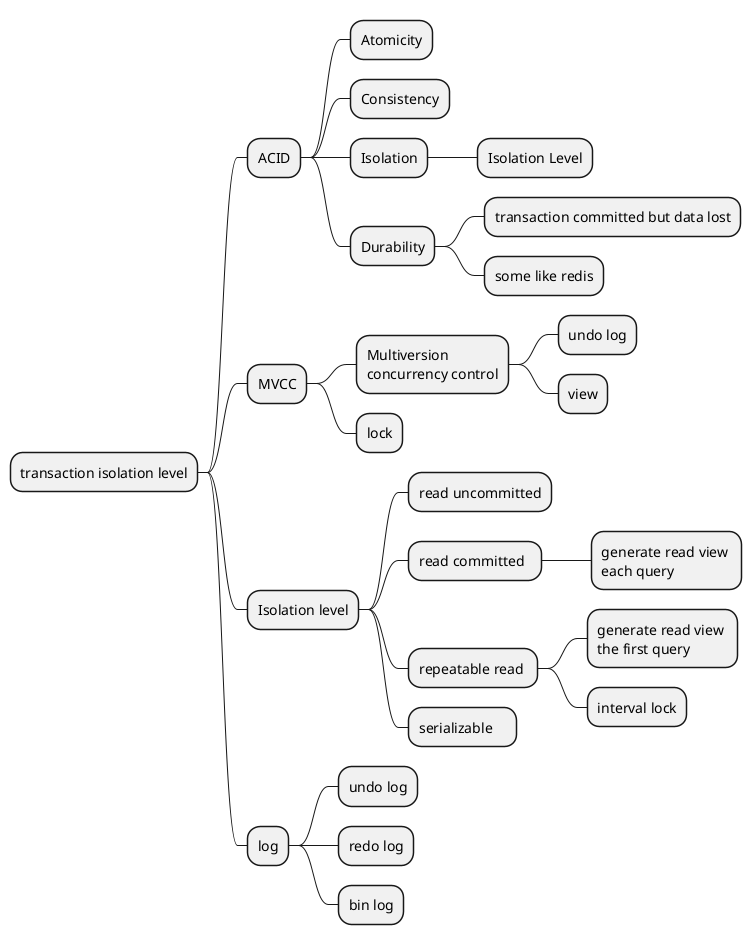

# mysql

## transaction isolation level



| isolation level  | dirty read | Non-repeatable Read | phantom read |
| ---              | ---        | ---                 | ---          |
| read uncommitted | possible   | possible            | possible     |
| read committed   | impossible | possible            | possible     |
| repeatable read  | impossible | impossible          | possible     |
| serializable     | impossible | impossible          | impossible   |


### enviroment
```sql
mysql> SELECT VERSION();
+-----------+
| VERSION() |
+-----------+
| 5.6.51    |
+-----------+
```
### table and data prepare
```sql
mysql> DROP TABLE IF EXISTS `demo_user`;
mysql> CREATE TABLE `demo_user` (
  `id` varchar(32) NOT NULL COMMENT '用户id',
  `name` varchar(16) NOT NULL COMMENT '用户名',
  `gender` tinyint(1) DEFAULT '0' COMMENT '性别',
  `age` int(3) unsigned DEFAULT NULL COMMENT '用户年龄',
  `gmt_create` datetime DEFAULT CURRENT_TIMESTAMP ON UPDATE CURRENT_TIMESTAMP COMMENT '记录创建时间',
  `gmt_modified` timestamp NULL DEFAULT NULL COMMENT '记录最近修改时间',
  `deleted` tinyint(1) DEFAULT '0' COMMENT '是否删除',
  `phone` varchar(11) NOT NULL COMMENT '电话号码',
  PRIMARY KEY (`id`),
  KEY `idx_phone` (`phone`),
  KEY `idx_name` (`name`)
) ENGINE=InnoDB DEFAULT CHARSET=utf8mb4 COMMENT='用户表';

insert  into `demo_user`(`id`,`name`,`gender`,`age`,`gmt_create`,`gmt_modified`,`deleted`,`phone`) values ('222','zzs001',0,18,'2021-12-13 15:11:03','2021-12-13 09:59:12',0,'188******26');
insert  into `demo_user`(`id`,`name`,`gender`,`age`,`gmt_create`,`gmt_modified`,`deleted`,`phone`) values ('111','zzf001',0,18,'2001-08-27 11:00:11','2001-08-27 11:00:13',0,'188******22');
```


### Dirty Read
| session 1                                                 | session 2                                                 |
| ---                                                       | ---                                                       |
| set session transaction isolation level read uncommitted; | set session transaction isolation level read uncommitted; |
| select @@session.tx_isolation;                            | select @@session.tx_isolation;                            |
| set autocommit = 0 ;                                      | set autocommit = 0 ;                                      |
|                                                           | update demo_user set age=19 where id='222';                |
| select age from demo_user where id = '222';               |                                                           |
|                                                           | rollback ;                                                |
| commit;                                                   |                                                           |

- solution 1
| session 1                                                      | session 2                                                 |
| ---                                                            | ---                                                       |
| set session transaction isolation level read uncommitted;      | set session transaction isolation level read uncommitted; |
| select @@session.tx_isolation;                                 | select @@session.tx_isolation;                            |
| set autocommit = 0 ;                                           | set autocommit = 0 ;                                      |
|                                                                | update demo_user set age=19 where id='222'                |
| select age from demo_user where id = '222' lock in share mode; |                                                           |
|                                                                | rollback ;                                                |
| commit;                                                        |                                                           |

- solution 2
| session 1                                               | session 2                                               |
| ---                                                     | ---                                                     |
| set session transaction isolation level read committed; | set session transaction isolation level read committed; |
| select @@session.tx_isolation;                          | select @@session.tx_isolation;                          |
| set autocommit = 0 ;                                    | set autocommit = 0 ;                                    |
|                                                         | update demo_user set age=19 where id='222';             |
| select age from demo_user where id = '222';             |                                                         |
|                                                         | rollback ;                                              |
| commit;                                                 |                                                         |


### Non-repeatable Read
| session 1                                               | session 2                                               |
| ---                                                     | ---                                                     |
| set session transaction isolation level read committed; | set session transaction isolation level read committed; |
| select @@session.tx_isolation;                          | select @@session.tx_isolation;                          |
| set autocommit = 0 ;                                    | set autocommit = 0 ;                                    |
| select age from demo_user where id = '222';             |                                                         |
|                                                         | update demo_user set age=19 where id='222';             |
|                                                         | commit ;                                                |
| select age from demo_user where id = '222';             |                                                         |
| commit;                                                 |                                                         |


- solution 1  add lock
| session 1                                                      | session 2                                               |
| ---                                                            | ---                                                     |
| set session transaction isolation level read committed;        | set session transaction isolation level read committed; |
| select @@session.tx_isolation;                                 | select @@session.tx_isolation;                          |
| set autocommit = 0 ;                                           | set autocommit = 0 ;                                    |
| select age from demo_user where id = '222' lock in share mode; |                                                         |
|                                                                | update demo_user set age=19 where id='222';             |
| select age from demo_user where id = '222' ;                   |                                                         |
| commit;                                                        |                                                         |
|                                                                | update demo_user set age=19 where id='222';             |
|                                                                | rollback ;                                              |

- solution 2  add lock
| session 1                                                | session 2                                                |
| ---                                                      | ---                                                      |
| set session transaction isolation level repeatable read; | set session transaction isolation level repeatable read; |
| select @@session.tx_isolation;                           | select @@session.tx_isolation;                           |
| set autocommit = 0 ;                                     | set autocommit = 0 ;                                     |
| select age from demo_user where id = '222' ;             |                                                          |
|                                                          | update demo_user set age=19 where id='222';              |
|                                                          | commit ;                                                 |
| select age from demo_user where id = '222' ;             |                                                          |
| commit;                                                  |                                                          |

### Phantom Read
| session 1                                                | session 2                                                                                                                                                                                    |
| ---                                                      | ---                                                                                                                                                                                          |
| set session transaction isolation level repeatable read; | set session transaction isolation level repeatable read;                                                                                                                                     |
| select @@session.tx_isolation;                           | select @@session.tx_isolation;                                                                                                                                                               |
| set autocommit = 0 ; start transaction;                  | set autocommit = 0 ; start transaction;                                                                                                                                                      |
| select * from demo_user;                                 |                                                                                                                                                                                              |
|                                                          | insert  into `demo_user`(`id`,`name`,`gender`,`age`,`gmt_create`,`gmt_modified`,`deleted`,`phone`) values ('444','zzf001',0,18,'2001-08-27 11:00:11','2001-08-27 11:00:13',0,'188******22'); |
|                                                          | commit ;                                                                                                                                                                                     |
| select * from demo_user;                                 |                                                                                                                                                                                              |
| commit;                                                  |                                                                                                                                                                                              |


## Download test database
```sh
gh repo clone datacharmer/test_db
wget https://downloads.mysql.com/docs/world-db.zip                       
wget https://downloads.mysql.com/docs/sakila-db.zip                      
wget https://downloads.mysql.com/docs/airport-db.zip                     
wget https://downloads.mysql.com/docs/menagerie-db.zip                   
wget https://github.com/datacharmer/test_db/archive/refs/tags/v1.0.7.zip 
```
then import the sakila database


```sql
mysql> SHOW ENGINES;
mysql> SHOW VARIABLES  LIKE '%storage_engine%';
mysql> SHOW VARIABLES  LIKE '%query_cache%';
```
```sql
use sakila;
mysql> show databases;
mysql> show tables;
mysql> ? show status
mysql> show status like 'Com_%';
mysql> show status like 'Innodb_%';
mysql> show status like 'Connections%';
mysql> show status like 'Uptime%';
mysql> show status like 'Slow_queries%';
mysql> show processlist;


mysql> explain select count(*) from actor t1, film_actor t2 where t1.actor_id=t2.actor_id;

mysql> explain select 1 from dual where 1;


```


